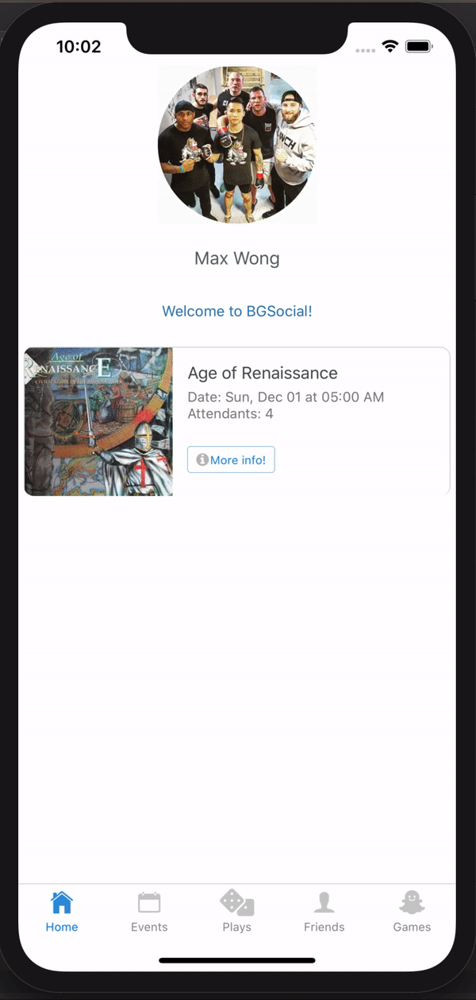
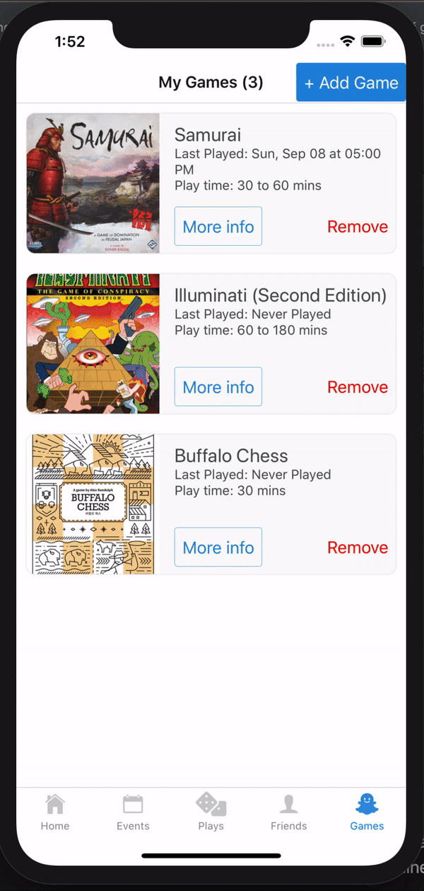
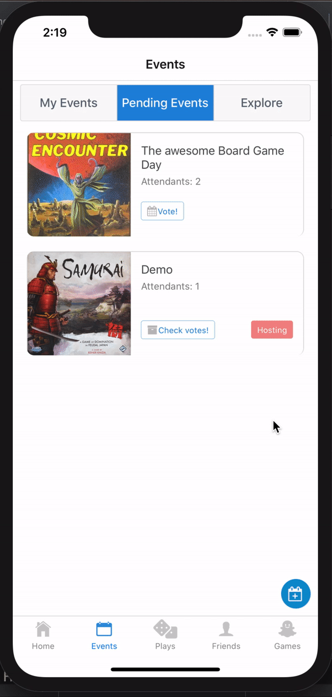
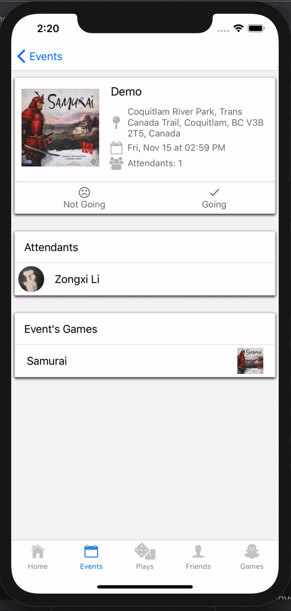
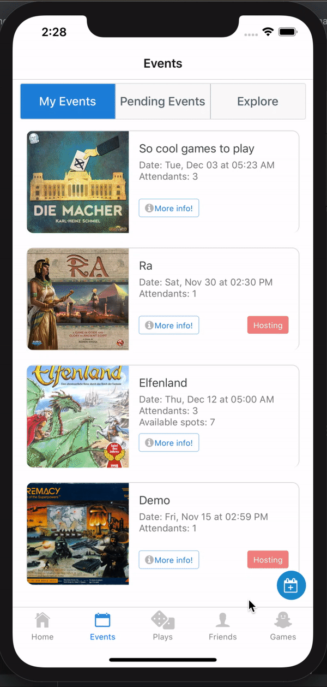
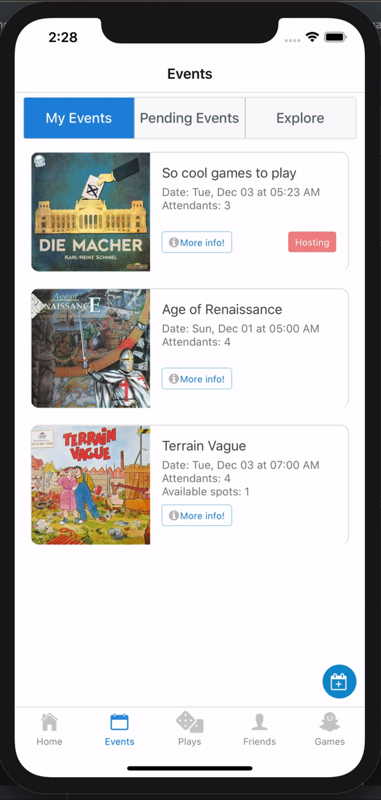
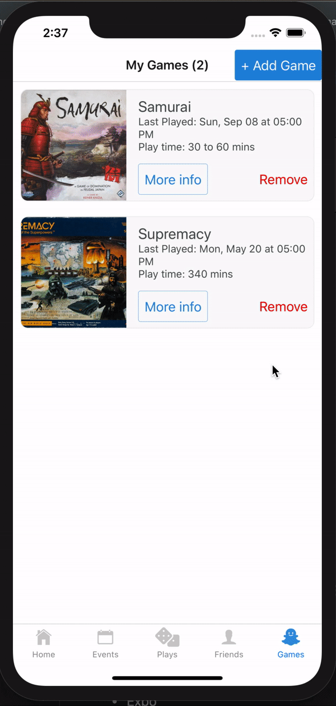

# BG Social - LHL Final Project

## About BG Social

- BG Social offers a Facebook like social platform for board game enthusiasts. It allows users to invite their friends (in-app) to participate in board game events and track participants' scores for each game. Moreover, it aims to solve the issue of coordination by introducing features such as **voting** and **open event**. The app encourages friendly competition by offering game / score related statistics with which users can compare with his / her friends. 

## Final Product
|Final Product Gif 1| Final Product Gif 2 |
|---|---|
||

## Features

### Befriend
|Befriend (Zongxi Account)| Befriend (Max Account)|
|---|---|
||

### Adding / Removing games from the game library 

### Event Related Features
|Inviting Friends to Event (Zongxi Account)|Accepting Invitation and Voting (Max Account)|
|---|---|
||

|Event Creator Finalize Date (Zongxi Account)|Confirm Going (Max Account)|
|---|---|
| | 

|Editing Event (Zongxi Account)|Open Event (Zongxi Account)| Explore Open Event (Max Account)|
|---|---|---|
|||

### Creating Play

### Game Statistics

  
## Technical Information / Stack
- React Native
- React Navigation
- React Native Elements
- Expo
- Javascript

## Dependencies

- "@expo/samples": "~3.0.3",
- "@expo/vector-icons": "^10.0.3",
- "@react-navigation/web": "^1.0.0-alpha.9",
- "axios": "^0.19.0",
- "expo": "^35.0.0",
- "expo-asset": "^7.0.0",
- "expo-constants": "^7.0.0",
- "expo-facebook": "~7.0.0",
- "expo-font": "^7.0.0",
- "expo-web-browser": "^7.0.0",
- "moment": "^2.24.0",
- "react": "16.8.3",
- "react-dom": "16.8.3",
- "react-native": "https://github.com/expo/react-native/archive/sdk-35.0.0.tar.gz",
- "react-native-chart-kit": "^3.10.0",
- "react-native-elements": "^1.2.6",
- "react-native-gesture-handler": "~1.3.0",
- "react-native-maps": "~0.25.0",
- "react-native-modal-datetime-picker": "^7.6.0",
- "react-native-selectmultiple-button": "^0.1.105",
- "react-native-svg": "^9.13.2",
- "react-native-svg-charts": "^5.3.0",
- "react-native-web": "^0.11.7",
- "react-navigation": "^3.12.0",
- "react-navigation-hooks": "^1.1.0"

## Dev Dependencies

- "@babel/core": "^7.6.4",
- "@storybook/addon-actions": "^5.2.5",
- "@storybook/addon-links": "^5.2.5",
- "@storybook/addons": "^5.2.5",
- "@storybook/react-native": "^5.2.5",
- "@storybook/react-native-server": "^5.2.5",
- "babel-loader": "^8.0.6",
- "babel-preset-expo": "^7.0.0",
- "jest-expo": "^35.0.0"

## Getting Started

1) Fork this repository, then clone your fork of this repository
2) Fork the [Custom Api Server](https://github.com/MaxWong03/BGSocial-API), then clone your fork of the api
3) Install dependencies with `npm i`
4) Install [Expo Cli](https://expo.io/learn)
5) Install Expo app on your mobile device
6) Run the [Custom Api Server](https://github.com/MaxWong03/BGSocial-API)
7) Run `expo start`
8) Run the Expo app on your app and scan the QR code produced by step 6)

## Project Team

- [Camila Rivera](https://github.com/CamilaRivera)
- [Zongxi Li](https://github.com/zongxili)
- [Max Wong](https://github.com/MaxWong03)

